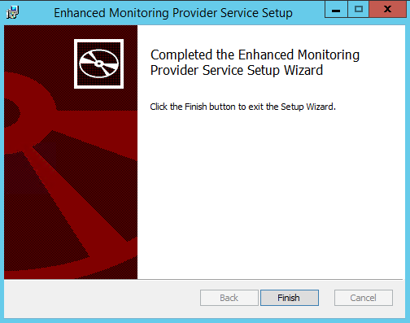
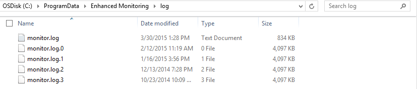

How to install the Enhanced Monitoring Service on Windows Server 2012 R2
======
This tool provides enhanced data monitoring for virtual machines. It allows you to monitor the performance and resource status of the physical server from within the virtual machine.	

Prerequisites
------
This tool relies on [KVP data exchange chanel](https://technet.microsoft.com/en-us/library/dn798297.aspx) to pass performance data from host to guest VM.
	
Installation
------
1. Download the  [EnhancedMonitoring.msi](https://github.com/OSTC/enhanced-monitoring-service/releases/download/v1.0/EnhancedMonitoring.msi) package
2. Run MSI to install the Enhanced Monitoring Service


Validate the installation
-----
After the installation confirm that  the "Enhanced Monitoring Provider Service" service is visible in the services console, and that it is automatically started.


Configuration
-----
#### Configure Enhanced Monitoring Service on the Host
The configuration file path is ```C:\ProgramData\Enhanced Monitoring\EnhancedMonitoringProviderConfig.xml```. You may modify the file to configure the Enhanced Monitoring Service. Any modification to the configuration file will only take effect after you restart the service.

Example: You can turn on verbose logging for troubleshooting by changing the  "LogLevel" value to “Verbose” :

```
  <!-- Optional -->
  <LogLevel>Verbose</LogLevel>
```
However, we advise to leave the configuration file unchanged unless there is a good reason to do so.

#### Configure the guest VM to receive monitoring data
A key-value-pair ```Enhanced_Monitoring_Supported=1``` needs to be presented by the guest VM to the host so that the host is aware that this particular guest VM is expecting monitoring data. Only then the  Enhanced Monitoring Service will populate the KVP data exchange channel for this VM with monitoring data.

On a Linux VM this can be done by writing the key-value-pair ```Enhanced_Monitoring_Supported=1``` to the file ```/var/lib/hyperv/.kvp_pool_1```. On a Windows VM, create a REG_DWORD registry key ```HKLM:\SOFTWARE\Microsoft\Virtual Machine\Guest\Enhanced_Monitoring_Supported``` and set to the value 1.

The sample code can be found under [sample](/sample).

Read monitoring data inside a guest VM
-----
After the guest VM is configured to receive monitoring data, the host will send monitoring data to the guest VM through the KVP channel.

In a Linux VM the data is received under ```/var/lib/hyperv/.kvp_pool_0```. In a Windows VM the data is received under the register key ```HKLM:\SOFTWARE\Microsoft\Virtual Machine\External```.

The performance data is base64-encoded and split into multiple parts to follow the length limitation of the KVP channel. The sample code for parsing the data can be found under [sample](/sample).

Trouble shooting
-----
All issues are logged under ```C:\ProgramData\Enhanced Monitoring\log```.



The Enhanced Monitoring Service has a limitation for the guest VM name. Guest VMs must have different names and the VM name must not contain the following characters:
```
( ) * / # "
```
This limitation is introduced by Hyper-V.

Refresh Rate
-----
If you have a large number of guest VMs (more than 40) running on the same host, you need to increase the refresh rate to 2 minutes. You can do this by setting the "RefreshRate" value in the configuration file to ```120``` and restart the service.
```
  <!-- Refresh interval in seconds-->
  <!-- Mandatory -->
  <RefreshRate>120</RefreshRate>
```

WMI quota
-----
The Enhanced Monitoring Service relies on the WMI Provider Service to monitor the performance and resource status of the physical server. However, the WMI Provider Service has a resource limitation  for threads, memory, etc. If you have a large number of VMs (more than 40), you need to increase the quota. Likewise,  if you have other work loads that might use the WMI Provider Service running on the same host, you also need to increase the quota.

[How to Increase WMI quota](http://blogs.technet.com/b/askperf/archive/2008/09/16/memory-and-handle-quotas-in-the-wmi-provider-service.aspx)

